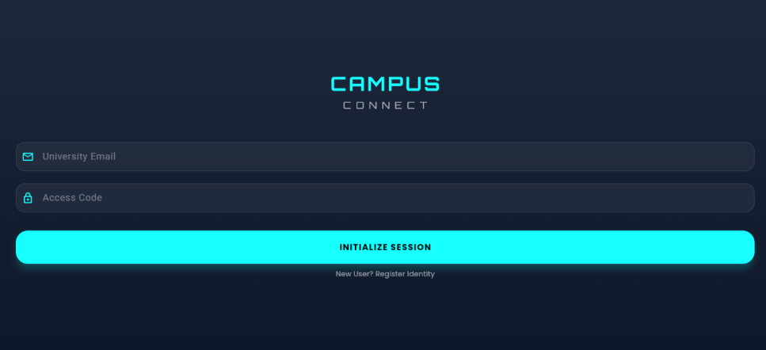
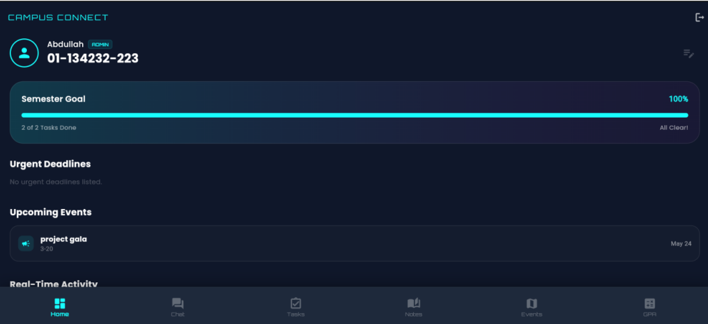
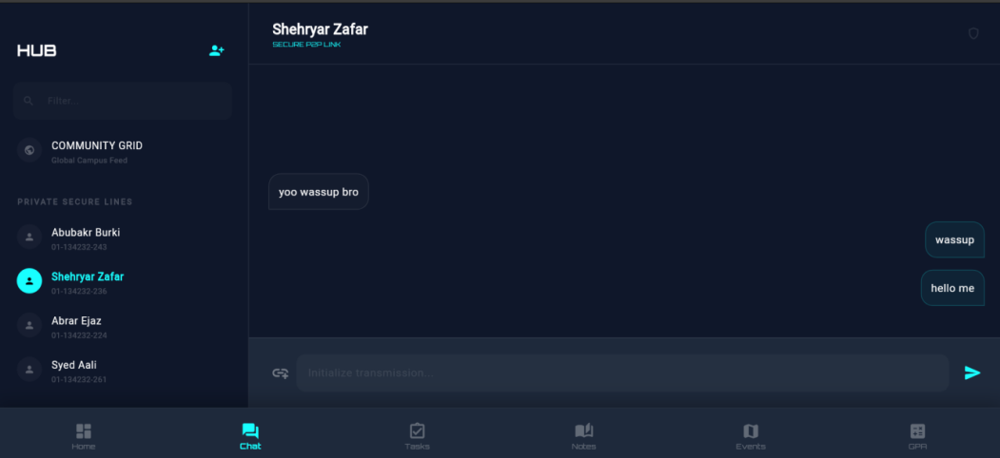
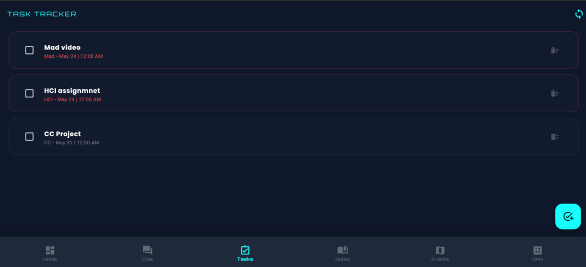
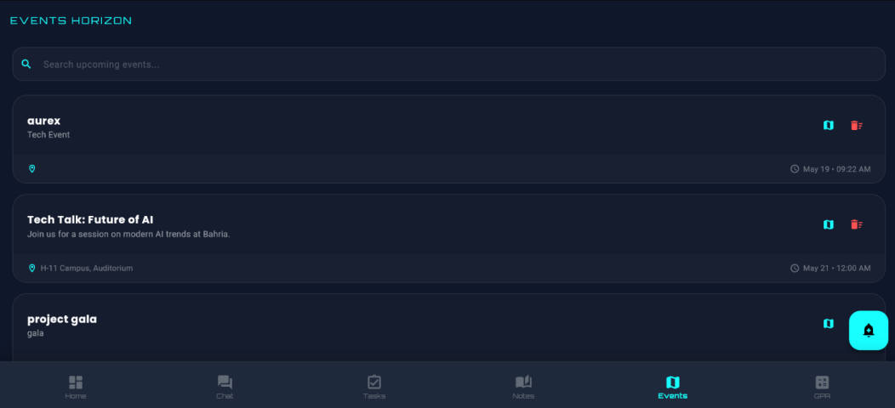
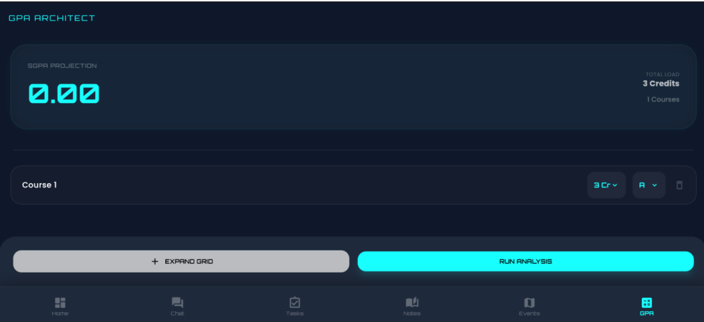
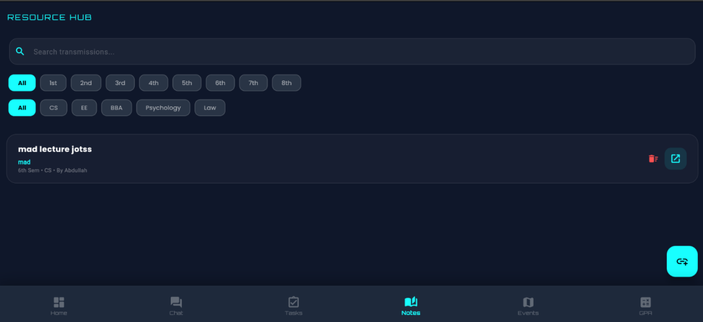
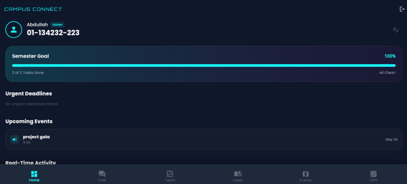

# 🎓 Campus Connect

> A Smart Student Companion Mobile Application built with Flutter & Firebase

Campus Connect is a cross-platform mobile application developed as a semester project for the **Mobile Application Development (MAD)** course at Bahria University Islamabad. The application centralizes essential academic and campus services into a single platform, reducing the need for multiple applications.

The app features secure authentication, real-time communication, task management, academic resources, GPA calculation, campus events, and LMS integration through a clean, modern user interface.

---

## 📱 Screenshots

| Login | Home | Chat |
|-------|------|------|
|  |  |  |

| Tasks | Events | GPA Calculator |
|-------|--------|----------------|
|  |  |  |

| Notes | Profile |
|-------|---------|
|  |  |

---

# ✨ Features

## 🔐 Authentication

- Email & Password Authentication
- Firebase Authentication
- Persistent Login Sessions
- Role-Based Access Control
- Secure User Management

---

## 👥 Role-Based Access

Three different user roles are supported:

- Student
- Class Representative (CR)
- Administrator

Each role has different permissions and available features.

---

## 💬 Real-Time Chat

- Public Group Chat
- Private Messaging
- Live Firestore Synchronization
- Auto-updating Messages
- User Lookup via Enrollment ID

---

## 📅 Task & Deadline Tracker

- Semester-wise filtering
- Department-wise filtering
- Mark tasks as completed
- Live synchronization
- Deadline management

---

## 📚 Resource Hub

Students can access:

- Lecture Notes
- Google Drive Resources
- Mega Links
- Course Material

Features include:

- Search
- Semester Filters
- Department Filters
- Direct URL Launching

---

## 🗺 Campus Events

- Interactive Maps
- OpenStreetMap Integration
- Event Creation
- Event Details
- Map Navigation

---

## 🎯 GPA Calculator

Dynamic GPA Calculator supporting:

- Multiple Courses
- Credit Hours
- Grade Selection
- Instant GPA Calculation

---

## 🌐 LMS Integration

- Embedded LMS Browser
- In-App WebView
- Easy Access to University LMS

---

## 🔔 Notifications

Firebase Cloud Messaging is integrated for:

- Assignment Alerts
- Event Notifications
- Important Announcements

---

# 🏗 Architecture

The project follows a **3-Layer Architecture**.

```
Presentation Layer
        │
Business Logic Layer
        │
Data Layer (Firebase)
```

### Presentation Layer

- Flutter Widgets
- Material Design
- Responsive UI
- Navigation
- Theme Management

### Business Layer

- Authentication Service
- Firestore Services
- Business Logic
- Validation

### Data Layer

- Firebase Authentication
- Cloud Firestore
- Firebase Storage
- Firebase Cloud Messaging

---

# 🛠 Tech Stack

| Technology | Purpose |
|------------|----------|
| Flutter | Cross Platform Development |
| Dart | Programming Language |
| Firebase Authentication | User Authentication |
| Cloud Firestore | Real-time Database |
| Firebase Storage | Media Storage |
| Firebase Cloud Messaging | Push Notifications |
| flutter_map | Interactive Maps |
| OpenStreetMap | Campus Mapping |
| flutter_inappwebview | LMS Integration |
| url_launcher | External Links |
| image_picker | Profile Images |
| Google Fonts | UI Typography |

---

# 📂 Project Structure

```
lib/
│
├── models/
├── screens/
├── services/
├── widgets/
├── utils/
├── main.dart
│
assets/
│
android/
ios/
windows/
linux/
macos/
web/
```

---

# 🚀 Getting Started

## Clone Repository

```bash
git clone https://github.com/YOUR_USERNAME/Campus-Connect.git
```

## Navigate

```bash
cd Campus-Connect
```

## Install Packages

```bash
flutter pub get
```

## Run Application

```bash
flutter run
```

---

# 🔥 Firebase Setup

This repository does **not** include Firebase configuration files.

To run the project:

1. Create a Firebase Project.
2. Enable Authentication.
3. Enable Cloud Firestore.
4. Enable Firebase Storage.
5. Enable Firebase Cloud Messaging.
6. Add:

```
android/app/google-services.json
```

and

```
ios/Runner/GoogleService-Info.plist
```

7. Run

```bash
flutterfire configure
```

---

# 📖 Main Modules

- Authentication
- Home Dashboard
- Chat Hub
- Task Tracker
- Resource Hub
- Events
- GPA Calculator
- Profile Management
- LMS Integration

---

# 🎨 UI Design

The application follows a modern dark theme featuring:

- Dark Color Palette
- Cyan Accent Colors
- Glassmorphism-inspired UI
- Responsive Layout
- Clean Typography
- Material Design Components

---

# 📈 Future Improvements

- Attendance Tracking
- QR Code Attendance
- Dark/Light Theme Switching
- Faculty Portal
- Timetable Module
- AI Study Assistant
- Assignment Submission
- Offline Synchronization
---

# 📄 License

This project was developed for educational purposes as part of the **Mobile Application Development (MAD)** course at Bahria University Islamabad.

---

# ⭐ Support

If you found this project helpful, consider giving it a ⭐ on GitHub!

---

## 👨‍💻 Developed By

**Muhammad Abdullah Abrar**

BS Computer Science  
Bahria University Islamabad

GitHub: https://github.com/mabdullahabrar

LinkedIn: [https://linkedin.com/in/mabdullahabrar](https://www.linkedin.com/in/mabdullahabrar/)
